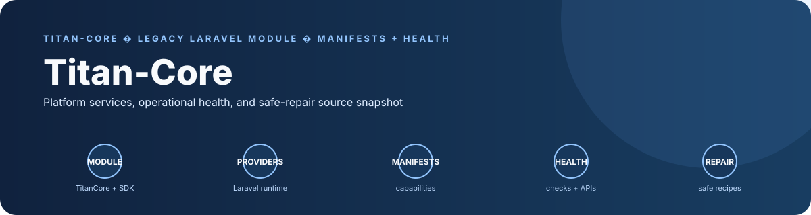
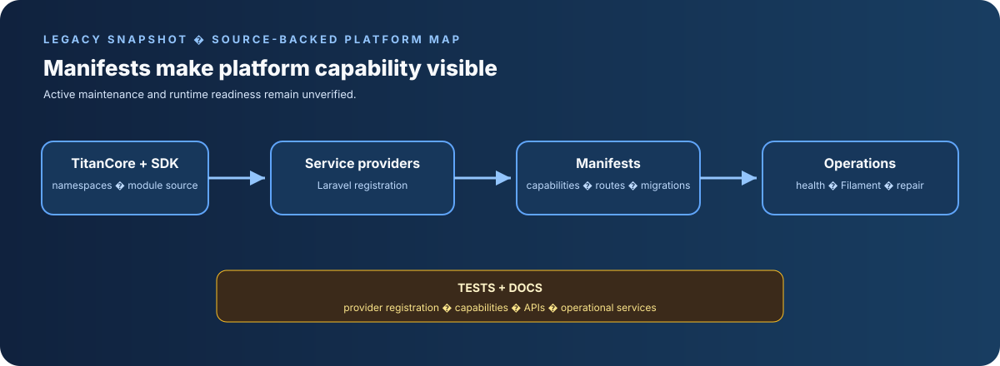

# TitanCore Platform Framework Archive

**An earlier TitanCore source snapshot and documentation repository.**

## Product architecture and engineering highlights

  

TitanCore is a Laravel platform module for shared AI infrastructure, platform services, and operational health across the Titan ecosystem.

- **Architecture:** An nWidart module exposes TitanCore and TitanSDK namespaces, registers Laravel service providers, and uses manifests to declare Filament surfaces, health checks, routes, migrations, and repair recipes.
- **Distinctive engineering:** A standout platform-engineering feature is manifest-driven health and safe-repair support, backed by tests for provider registration, capabilities, APIs, and operational services.

> **Status: legacy snapshot; active maintenance and runtime readiness unverified.** The inspected root contains `TitanCore_V1.9/` and `Docs/`. No root-level dependency manifest is present; this README is the portfolio landing page.

## Relationship to Titan Zero

The current field-service platform is maintained in [Titan Zero Field Service Workforce](https://github.com/Masterleeaus/Titan-Zero-Field-Service-Workforce). This repository should be treated as an earlier codebase or source reference unless its history establishes a separate maintained product.

## Repository contents

- `TitanCore_V1.9/` — versioned application source
- `Docs/` — project documentation

Inspect manifests and documentation inside those directories for the supported setup and test commands. They have not been independently verified in this review.

## Portfolio classification

**Historical/source repository pending lineage review.** Compare its unique files, history, and licensing with `Titanzero`, `Titan-BOS`, `zero`, and the canonical workforce repo before deciding whether to archive or retire it.

## Security and provenance

Review imported code provenance and applicable licenses before reuse or redistribution. Keep credentials and customer data out of version control.

## Banner

A checked-in project-specific banner is displayed above.

## Engineering guide

See [docs/PORTFOLIO.md](docs/PORTFOLIO.md) for the repository-specific code map, quickstart, evidence boundaries, and limitations.
