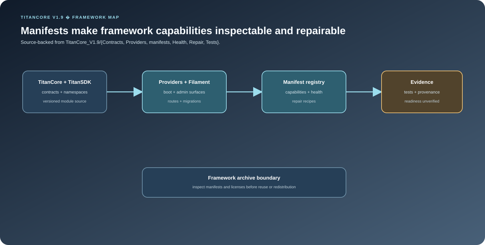

<div align="center">

# Titan-Core — TitanCore Platform Framework Archive

**Platform framework for shared AI infrastructure**

</div>

Titan-Core is a versioned Laravel platform-kernel snapshot for shared AI infrastructure, public SDK contracts, manifest-driven module integration, and operational health. It is the kind of platform work that makes multiple AI-enabled modules easier to compose, inspect, and evolve.

## What the framework implements

- **Ordered AI orchestration:** `TitanCore_V1.9/AI/AIOrchestratorPipeline.php` runs guardrail, retrieval, tool execution, and citation stages in a defined order; a failed guardrail returns a blocked result before later stages run.
- **Provider resilience:** `TitanCore_V1.9/Services/ProviderFailoverChain.php` tries ordered chat or embedding providers, handles configured retryable statuses, and returns the last meaningful failure when the chain cannot complete.
- **Public/runtime separation:** `TitanCore_V1.9/TitanSDK/` exposes stable contracts, events, exceptions, facades, and manifests for consuming modules, while runtime/provider/controller implementation remains inside TitanCore.
- **Manifest-backed operations:** module metadata, capabilities, provider registration, health checks, repair conventions, and platform surfaces are discoverable through the versioned module structure.

## Architecture and code map

<p align="center">
  
</p>

| Area | Responsibility |
| --- | --- |
| `TitanCore_V1.9/AI/` | Orchestration, provider adapters, tool execution, permission gates, retrieval, vectors, and value objects. |
| `TitanCore_V1.9/Services/` | Model gateway, provider failover, AI run logging, settings, and platform services. |
| `TitanCore_V1.9/TitanSDK/` | Stable consumer-facing contracts, events, exceptions, facades, and manifests. |
| `TitanCore_V1.9/Providers/`, `Routes/`, `Http/`, `Database/`, `Jobs/` | Laravel integration, persistence, APIs, and background work. |
| `TitanCore_V1.9/Docs/` | Testing guidance, starter-kit material, scan reports, and runtime verification records. |

## Evidence and developer entry points

The versioned source includes unit and feature coverage for provider adapters, manifest validation, tool execution, vector stores, platform health, routes, and the SDK extraction boundary. The host-integration test guide uses:

```bash
php artisan test --testsuite=Unit
php artisan test --testsuite=Feature
```

The repository also has a dependency-free hygiene check:

```bash
node scripts/check-repository-hygiene.mjs
```

That check records the two explicitly bounded deprecated alias collisions and the retained blueprint ZIP, and fails on new collisions, stale inventory, or OS metadata.

## Why the separation matters

TitanSDK gives consuming modules a stable integration surface while TitanCore retains runtime orchestration and provider internals. The trade-off is that a host application must supply Laravel, dependency installation, configuration, and the surrounding module ecosystem; the archive is not a standalone application.

## Scope and provenance

Titan-Core is a versioned framework/source snapshot rather than a blanket production-readiness claim. The runtime verification audit records implemented, partial, and unverified behavior, including direct AI paths that still need consolidation around the central gateway.

The repository preserves nested source, starter-kit material, scan reports, SDK code, and a lineage blueprint archive. See [docs/REPOSITORY_HYGIENE.md](docs/REPOSITORY_HYGIENE.md) for the exact retention boundary and retirement recommendations. Preserve existing license and attribution records before redistributing or presenting the snapshot as wholly original work.

For the detailed architecture and evidence map, see [docs/PORTFOLIO.md](docs/PORTFOLIO.md).